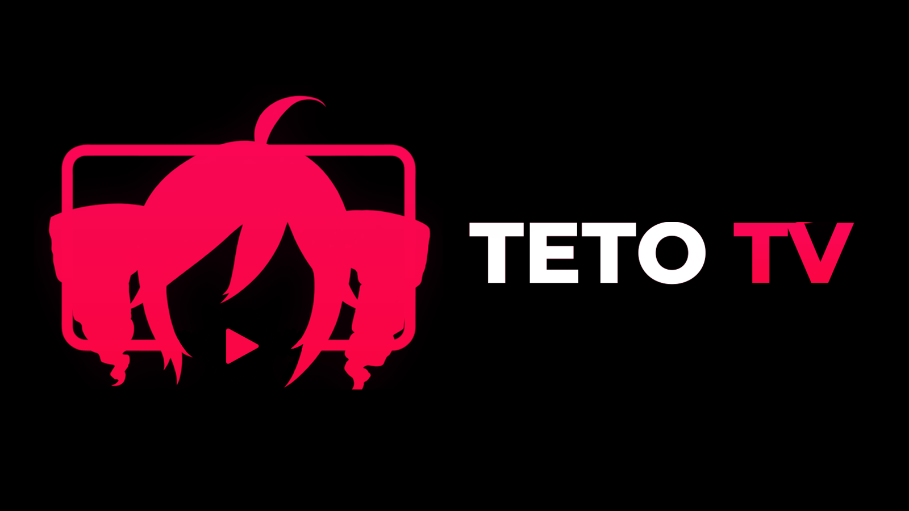
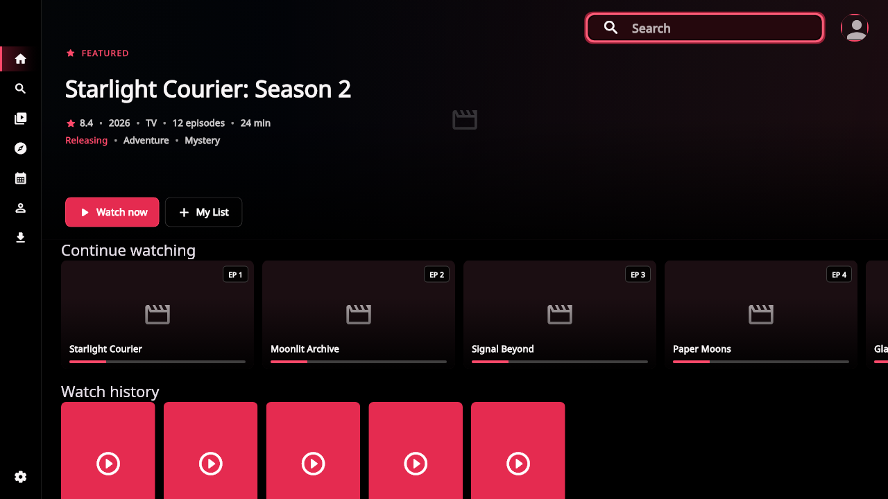
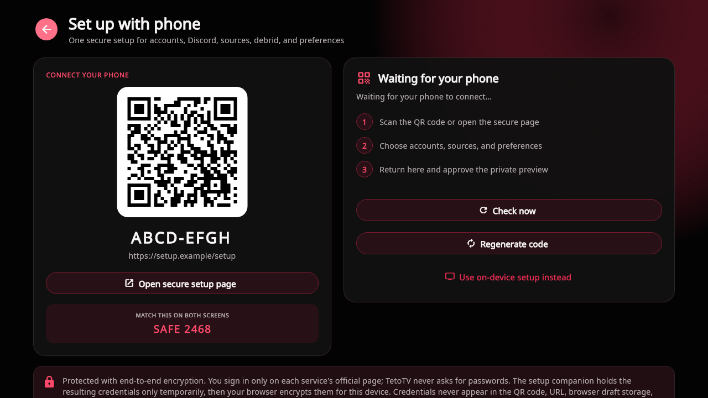
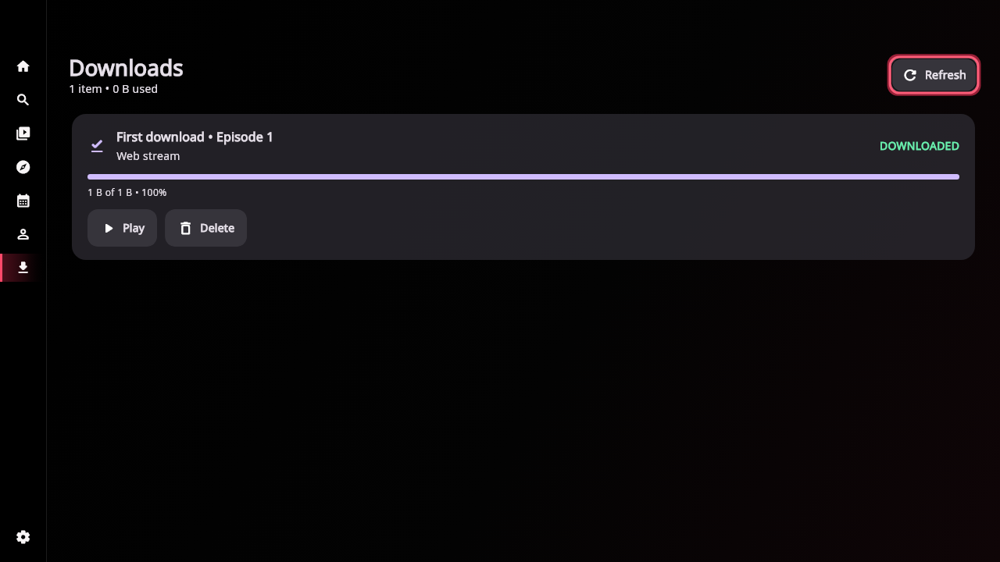
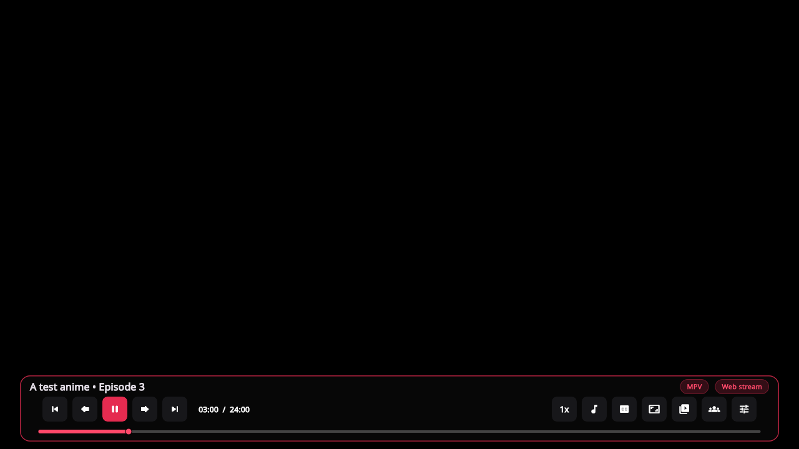
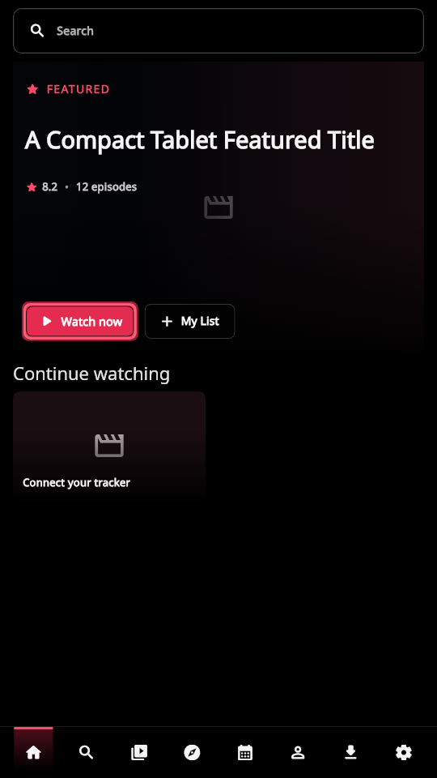

  

<h1 align="center">TetoTV Beta</h1>

  <strong>A TV-first media library, playback, and tracking client for Android TV, Google TV, Fire TV, tablets, and phones.</strong>

  
  
  
  

  <a href="https://github.com/LindersOSX/TetoTV-Beta/releases/latest"><strong>Download Beta</strong></a>
  · <a href="docs/RELEASE_NOTES_2.0.54.md">What's new</a>
  · <a href="https://github.com/LindersOSX/TetoTV-Beta/issues/new">Report an issue</a>
  · <a href="https://discord.gg/juC6k7d4WY">Discord</a>
  · <a href="https://www.youtube.com/@TetoTVApp">YouTube</a>

> [!IMPORTANT]
> TetoTV is a user-configured media client. It does not host, index, supply, recommend, or endorse media sources, provider extensions, marketplace catalogs, or credentials. No third-party catalog or provider is bundled or preconfigured. Viewers must be authorized to access, play, and download the media they connect.

TetoTV runs directly on the Android device with no companion server required for normal browsing and playback. This repository contains the complete application source and the Beta release channel—not only APK downloads.

> [!NOTE]
> **AI-assisted development:** TetoTV uses AI tools to assist with code, design iteration, documentation, tests, and review. The maintainer directs project decisions and remains responsible for validating changes and approving releases. AI assistance is not an independent legal or security certification.

## See TetoTV in action

  

<table>
  <tr>
    <td width="50%"></td>
    <td width="50%"></td>
  </tr>
</table>

  

  

<em>These captures use synthetic demo titles and local fixtures. The displayed QR points to a reserved <code>.example</code> domain and is not a live pairing session.</em>

## Why TetoTV

| Designed for the couch | Comfortable on phones |
| --- | --- |
| Predictable D-pad movement, visible focus, TV-scale layouts, and a persistent navigation path. | The same theme and features adapt to bottom navigation in portrait and a left rail in landscape. |
| **Bring your own services** | **Profiles and tracking** |
| Clean installs contain no source catalog. Viewers connect only accounts, personal libraries, and HTTPS extensions they choose. | Local profiles work without an account; optional AniList and MyAnimeList connections can sync lists and progress. |
| **Integrated playback** | **Downloads and Watch Party** |
| MPV playback includes audio and subtitle selection, speed controls, TV-friendly seeking, and optional skip timing. | Authorized media can be saved for offline playback, while synchronized rooms provide host-controlled viewing. |

## Feature matrix

| Capability | Status | Notes |
| --- | --- | --- |
| Android TV and Google TV | Supported | Modern Layout is designed for D-pads and TV remotes. |
| Amazon Fire TV / Fire OS | Supported | Fire OS 6 or newer; Fire OS 5 is not supported. |
| Standalone use | Supported | No PC app or companion server is required for normal browsing and playback. |
| User-supplied extensions | Optional | No extension or catalog is bundled, recommended, or endorsed. Compatibility depends on the service the user configures. |
| AniList / MyAnimeList | Optional | Sync lists and progress, or use a local-only profile. |
| MPV playback | Supported | Integrated audio/caption selection remembers explicit choices between episodes; Playback settings include Preferred CC Automatic, On, and Off. |
| Offline downloads | Beta | Individual episodes, whole-season queues, and offline playback. |
| Debrid services | Optional | Users may connect a supported account for media they are authorized to access. |
| Direct peer-to-peer playback | Optional beta | Off by default and requires an explicit privacy warning and opt-in. |
| Plex / Jellyfin | Optional | Requires the viewer's own configured media server. |
| Watch Party | Beta | Synchronized rooms use TetoTV's hosted coordination service. |

## Current releases

| Channel | Version | Best for |
| --- | --- | --- |
| Public | Not published | Source and release-readiness documents are available, but no Public APK is currently offered |
| Beta | [2.0.54](docs/RELEASE_NOTES_2.0.54.md) | Testing TV Settings focus stability, responsive mobile Settings, and smoother D-pad navigation |

> [!WARNING]
> Beta 2.0.54 uses the repository's explicit unreviewed-Beta exception. Its native-library and corresponding-source material did not receive independent license review, and automated integrity checks are not a legal compliance determination. Read the [complete Beta disclosure](docs/RELEASE_NOTES_2.0.54.md). This exception does not apply to a future Public release.

The Public updater repository intentionally has no release while the Public build is held for review. Existing Beta installations continue to update from the Beta repository. Android never permits an in-place install of an APK with a lower build code; Developer Mode does not bypass that platform rule.

## Android TV / Fire TV

TetoTV's Modern Layout is built around visible focus, predictable D-pad movement, large-screen spacing, and a reliable path back to navigation. Google TV devices use the Android TV build. Android phones use the same theme and features with a bottom navigation bar in portrait and a left rail in landscape.

The current universal APK supports:

- `arm64-v8a` (ARM64), used by many newer Android TV, Google TV, and Fire TV devices.
- `armeabi-v7a` (ARM32), used by many older or lower-cost Fire TV devices.
- Android 7.0 / API 24 or newer, including Fire OS 6 and newer.

Fire OS 5 devices cannot install the current build because they are below the minimum Android API level.

## Standalone architecture / no server required

TetoTV installs directly on the TV or Android device. Normal discovery, source selection, playback, tracking, and downloads do not require a companion app, Docker container, desktop process, or self-hosted TetoTV server.

You connect only the services you choose. Account linking and Watch Party use TetoTV-hosted coordination where needed, while Plex and Jellyfin require a personal server only when those optional integrations are enabled.

## User-supplied extensions

TetoTV includes a generic compatibility layer for user-supplied HTTPS extensions. Extensions are untrusted third-party code, are not reviewed or endorsed by TetoTV, and remain subject to bounded runtime and network controls. Technical compatibility does not mean that an extension or its content is lawful, safe, or approved.

TetoTV ships without a catalog, suggested repository, provider, media index, or automatic installation path. Users must add extensions themselves and should connect only services and media they are authorized to use. Provider cards can display recent compatibility results and the last test date to help diagnose user-configured integrations.

Third-party services and extensions can change independently of TetoTV. TetoTV does not host or relay their media and does not guarantee their availability, legality, security, or fitness for use.

## Downloads

The 2.0 Beta can save supported individual episodes or whole seasons from sources the user is authorized to download to a persistent Download Manager. Downloads are stored in a predictable show, season, and episode structure and include queue state, progress, speed, storage use, pause/resume, retry, cancel, and delete controls.

Completed episodes appear as offline choices in the normal source picker and play through the normal MPV player. Basic show metadata and artwork remain available offline, watch progress is saved locally, and queued AniList/MyAnimeList updates retry when the connection returns.

Downloads continue while TetoTV is minimized. If Android stops the process, an unfinished season plan resumes the next time the app opens. Android force-stop always ends active app work. Sources that rely on short-lived or private authorization may need to be selected again.

## User-configured Debrid and peer-to-peer integrations

TetoTV can connect to supported Debrid accounts selected and authorized by the user. Results can appear alongside user-configured extensions, downloaded media, and personal-library sources.

Direct peer-to-peer playback and downloads are optional Beta features and are off by default. Enabling them requires a warning because public peers and trackers can see the viewer's public IP address, and the device may upload pieces. TetoTV uses a bounded temporary cache for playback and clears it when playback closes.

Users are responsible for the services and sources they configure and for following the laws that apply to them.

## AniList / MyAnimeList

AniList and MyAnimeList connections are optional. Either tracker can sync lists and watch progress, while a local profile keeps the app usable without a tracker account. Catalog metadata uses mapped backup services when AniList is temporarily unavailable.

Calendar notifications can alert viewers when followed Sub/simulcast episodes reach their scheduled airtime. Dub alerts are separate and remain idle unless TetoTV has a verified Dub schedule; the app does not guess a Dub release from the Japanese broadcast time.

Discord Rich Presence is also optional and can show what is playing after the viewer links Discord.

## Plex / Jellyfin as optional integrations

Plex and Jellyfin are personal-media integrations, not requirements. When configured, TetoTV matches library episodes to the anime being viewed and adds them to the same show page, episode screen, source picker, history, progress, and previous/next episode flow used by online and downloaded sources.

If Plex or Jellyfin is not configured—or the selected episode is not in the library—those sources stay hidden. A personal media server is required only for the integration the viewer chooses to use.

## MPV playback and TV controls

TetoTV uses MPV for its integrated player across supported user-configured services, downloaded media, Plex, Jellyfin, and local files. Playback controls include:

- Previous and next episode.
- Intro and outro skipping when timing data is available.
- Optional filler skipping and filler labels.
- Progress-bar scrubbing with scene previews.
- D-pad seeking, including held-button seeking.
- Playback speeds from 0.5x to 2x.
- Audio, subtitle, aspect-ratio, and decoder controls.
- In-app trailers on supported show pages.
- Automatic source fallback that keeps position and preferred quality when possible.

Viewers can also choose a specific installed external player in Settings. External players do not carry TetoTV's Watch Party, skip, fallback, or progress controls while the other app is open.

## Watch Party

Create or join a Watch Party from navigation, an episode screen, or the player. The host controls playback while guests stay synchronized. Rooms show participants, support host transfer and kicking, and display small join, leave, kick, and transfer notifications.

Watch Party is enabled by default but can be turned off in Settings, which removes its navigation and episode-screen entry points.

## Install

1. Open the [current Beta release](https://github.com/LindersOSX/TetoTV-Beta/releases/latest). No Public APK is currently published.
2. Download the file ending in `-universal.apk`.
3. Allow installation from the browser or file manager if Android asks.
4. Open TetoTV and complete the short setup.

The universal APK contains both ARM32 (`armeabi-v7a`) and ARM64 (`arm64-v8a`) native libraries for compatible Android TV, Google TV, and Fire TV devices.

## Updates and release channels

TetoTV checks the two GitHub release repositories directly. APK downloads do not pass through a TetoTV server, and the app verifies package, version, architecture, and signer information before opening the Android installer.

- A future Public build will use the `1.0.x` version line after a separate release review. The Public repository currently returns no release.
- Beta builds use the `2.0.x` version line.
- Release history remains available in Developer Mode. Android still blocks installing a build with a lower build code.

The main TetoTV repository holds the full Flutter, Android, native-integration, test, documentation, and release-tooling source. GitHub Releases are one part of the project, not the purpose of the repository.

## Diagnostics and privacy

Anonymous crash reporting is off by default. A diagnostics report is created only when the viewer chooses to share one. Reports include a bounded 48-hour troubleshooting timeline while automatically removing credentials, room codes, media URLs, filenames, and private-server information.

Beta builds offer an approximate anonymous aggregate live count, enabled by default with a Settings opt-out. It sends only `active` or `streaming` for a short-lived process session—never a profile, title, episode, source, device ID, URL, filename, or private-server information. Public builds disable this presence; no Public APK is currently published.

Read the complete [privacy documentation](docs/PRIVACY.md) for report contents, redaction, optional integrations, and network behavior.

## Source code and licenses

TetoTV-authored source code is available in this repository under the MIT License. Distributed releases include the required third-party notices and native corresponding-source materials, including pinned MPL-covered source used by the optional direct-torrent engine. Bundled third-party components keep their own licenses and terms.

TetoTV uses third-party services and open-source components but is not affiliated with, sponsored by, or endorsed by AniList, MyAnimeList, Discord, Amazon, Google, Plex, Jellyfin, or any streaming or Debrid provider. See the [content and source policy](CONTENT_POLICY.md) for the repository boundary and reporting path.

## Project documentation

| Document | Covers |
| --- | --- |
| [Content and source policy](CONTENT_POLICY.md) | Repository boundaries, prohibited source material, and rights reports |
| [Privacy documentation](docs/PRIVACY.md) | Optional network features, diagnostics, redaction, and data handling |
| [Security policy](SECURITY.md) | Private vulnerability reporting and supported releases |
| [Architecture](docs/ARCHITECTURE.md) | Application layers, storage, playback, and hosted coordination |
| [Windows build guide](docs/BUILD_WINDOWS.md) | Reproducing the Flutter and Android build locally |
| [Update channels](docs/UPDATE_CHANNELS.md) | Beta/Public identity, signatures, versioning, and updater behavior |
| [Third-party notices](docs/THIRD_PARTY_NOTICES.md) | Component licenses, service terms, and attribution |

## Help and feedback

For public bugs and feature requests, [open a GitHub issue](https://github.com/LindersOSX/TetoTV-Beta/issues/new). For announcements and community support, [join the TetoTV Discord](https://discord.gg/juC6k7d4WY). Security vulnerabilities should follow the private process in [SECURITY.md](SECURITY.md), not a public issue.

When reporting a bug, include the TetoTV version, device model, Android or Fire OS version, steps to reproduce it, and a diagnostics report when possible.
